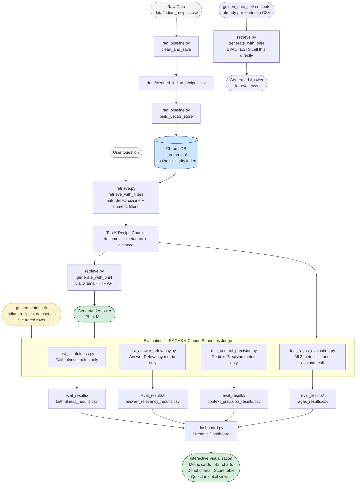

# Indian Recipes RAG — Complete Project Overview

---

## Table of Contents

1. [What This Project Does](#1-what-this-project-does)
2. [End-to-End Workflow Flowchart](#2-end-to-end-workflow-flowchart)
3. [Step-by-Step Implementation](#3-step-by-step-implementation)
4. [RAGAS Framework — How It Works](#4-ragas-framework--how-it-works)
5. [Evaluation Metrics — The RAG Triad](#5-evaluation-metrics--the-rag-triad)
6. [Tools & Technologies — What, Why, How](#6-tools--technologies--what-why-how)
7. [Requirements — Every Dependency Explained](#7-requirements--every-dependency-explained)
8. [Project Structure — Every File Explained](#8-project-structure--every-file-explained)
9. [Golden Dataset](#9-golden-dataset)
10. [Multi-Collection Support](#10-multi-collection-support)
11. [Result Files & What They Contain](#11-result-files--what-they-contain)
12. [How to Run Everything](#12-how-to-run-everything)
13. [Token & Cost Estimate](#13-token--cost-estimate)

---

## 1. What This Project Does

This project builds and evaluates a **Retrieval-Augmented Generation (RAG)** pipeline for Indian recipes.

A user asks a natural language question like *"How do I make Butter Chicken?"* or *"What are low-calorie South Indian breakfast recipes under 30 minutes?"*

The system:
1. **Retrieves** the most relevant recipe chunks from a vector database (ChromaDB)
2. **Generates** a grounded answer using a local LLM (Phi-4 Mini via Ollama)
3. **Evaluates** the quality of that answer using the **RAGAS library (v0.4.3)** — three metrics (Faithfulness, Answer Relevancy, Context Precision) with Claude Sonnet 4.6 as the LLM judge
4. **Visualises** the evaluation results in an interactive Streamlit dashboard

ChromaDB supports **multiple collections** — the same `chroma_db/` folder can hold Indian recipes, financial reports, medical records, or any other domain. Each collection is queried and evaluated independently.

---

## 2. End-to-End Workflow Flowchart



---

## 3. Step-by-Step Implementation

### Step 1 — Raw Data Ingestion

**File:** `rag_pipeline.py → clean_and_save()`

The raw dataset (`data/indian_recipies.csv`) contains recipe names, ingredients, instructions, cuisine type, cooking time, and nutritional data (calories, protein, carbs, fats, fibre, sodium).

What happens:
- Column names are normalised (whitespace stripped, typo "Recipie" → "Recipe" fixed)
- Rows missing Recipe Name, Ingredients, or Instructions are dropped
- Duplicate recipe names are removed
- Clean data is saved to `data/cleaned_indian_recipes.csv`

---

### Step 2 — Embedding & Vector Store (ChromaDB)

**File:** `rag_pipeline.py → build_vector_store()`

Each cleaned recipe is converted into a single text document:

```
Recipe: Butter Chicken
Cuisine: North Indian Recipes
Time to cook: 45 minutes
Ingredients: chicken, yogurt, tomatoes, butter, cream, spices…
Instructions: Marinate chicken…
Nutrition per serving — Calories: 300 kcal | Protein: 28 g | …
```

This document is embedded using `all-MiniLM-L6-v2` (SentenceTransformers) — a fast, lightweight model that produces 384-dimension semantic vectors. The vectors are upserted into a ChromaDB persistent collection with cosine similarity as the distance metric.

Metadata stored alongside each vector:
- `recipe_name`, `cuisine`, `total_time_in_minutes`, `ingredient_count`, `calories`, `protein_g`, `carbs_g`, `fats_g`

Metadata is stored as floats so ChromaDB's `$gte` / `$lte` range filters work at query time.

---

### Step 3 — Filtered Retrieval

**File:** `retrieve.py → retrieve_with_filters()`

When a user asks a question, the system:

1. **Auto-detects cuisine** from the query text (e.g. "South Indian" → filters to South Indian Recipes)
2. **Auto-detects numeric constraints** using regex patterns:
   - *"under 30 minutes"* → `max_time_in_minutes=30`
   - *"low-calorie"* → `max_calories=200`
   - *"fewer than 8 ingredients"* → `max_ingredient_count=8`
   - *"between 200 and 400 kcal"* → `min_calories=200, max_calories=400`
3. **Embeds the query** with the same SentenceTransformer model
4. **Queries ChromaDB** with the vector + any metadata filters combined via `$and`
5. Returns the top-K most semantically similar recipe chunks

Explicit keyword arguments (e.g. `--cuisine`, `--max-calories`) override the auto-detected values.

---

### Step 4 — Answer Generation (Phi-4 Mini)

**File:** `retrieve.py → generate_with_phi4()`

The retrieved recipe chunks are concatenated into a context block and sent to Phi-4 Mini running locally via Ollama:

```
You are a knowledgeable Indian cuisine assistant.
Answer the user's question using ONLY the recipe information below.
Context: [retrieved recipes]
Question: [user question]
Answer:
```

Phi-4 Mini is used as the generator because:
- It runs locally (free, no API cost)
- It is fast enough for evaluation loops over 9+ rows
- The goal is to test the RAG pipeline quality, not the generator LLM

---

### Step 5 — Golden Dataset

**File:** `golden_data_set/indian_recipies_dataset.csv`

A curated set of 9 test cases hand-crafted for evaluation:

| Rows | Content | Purpose |
|------|---------|---------|
| 1–7 | Real questions with correct matching context and ground-truth answers | Test that the pipeline scores well on valid inputs |
| 8–9 | Questions paired with deliberately wrong/mismatched context | Test that the evaluator correctly detects failures |

Rows 8–9 are the "deliberate fail" cases:
- Row 8: Butter Chicken question + Bengali Payesh context → should score low on Context Precision
- Row 9: Masala Dosa calories question + Gongura Chicken context → should score low on all three metrics

---

### Step 6 — Evaluation (RAGAS + Claude Sonnet as Judge)

**Files:** `eval_tests/ragas_eval/test_*.py`

All three RAG-Triad metrics are evaluated using **RAGAS v0.4.3** with Claude Sonnet 4.6 as the judge LLM.

**Data flow inside a test file:**

```python
# 1. Build RAGAS samples from the golden dataset
sample = SingleTurnSample(
    user_input=question,       # the question
    response=answer,           # Phi-4's generated answer
    retrieved_contexts=contexts,  # list of retrieved chunks
    reference=ground_truth,    # expected correct answer
)

# 2. Run all metrics in one batched evaluate() call
dataset = EvaluationDataset(samples=[sample, ...])
result  = evaluate(dataset=dataset, metrics=[faithfulness, context_precision, answer_relevancy])

# 3. Extract scores
scores_df = result.to_pandas()  # columns: faithfulness, context_precision, answer_relevancy
```

**Claude is wired into RAGAS via LangChain:**
```python
from langchain_anthropic import ChatAnthropic
from ragas.llms import LangchainLLMWrapper

_llm = LangchainLLMWrapper(ChatAnthropic(model="claude-sonnet-4-6"))
faithfulness.llm      = _llm
context_precision.llm = _llm
answer_relevancy.llm  = _llm
```

**Embeddings for Answer Relevancy** (cosine similarity between questions):
```python
from langchain_huggingface import HuggingFaceEmbeddings
from ragas.embeddings import LangchainEmbeddingsWrapper

answer_relevancy.embeddings = LangchainEmbeddingsWrapper(
    HuggingFaceEmbeddings(model_name="all-MiniLM-L6-v2")
)
```

---

### Step 7 — Pytest Tests

**Folder:** `eval_tests/ragas_eval/`

Four test files, each producing its own CSV:

| File | Metric tested | Output CSV |
|------|--------------|------------|
| `test_faithfulness.py` | Faithfulness only | `faithfulness_results.csv` |
| `test_answer_relevancy.py` | Answer Relevancy only | `answer_relevancy_results.csv` |
| `test_context_precision.py` | Context Precision only | `context_precision_results.csv` |
| `test_ragas_evaluation.py` | All 3 metrics in one session | `ragas_results.csv` |

All tests:
- Generate all Phi-4 answers first, then call `ragas.evaluate()` in a single batched call
- Assert that the mean score across all rows is ≥ 0.5 (configurable via `SCORE_THRESHOLD`)
- `EVAL_SAMPLE_SIZE` env var limits the number of rows evaluated (default: 9)
- `GOLDEN_CSV` env var lets you point at a different dataset CSV

---

### Step 8 — Streamlit Dashboard

**File:** `dashboard.py`

After tests run and CSVs are written, the dashboard reads them and displays:

1. **Sidebar** — switch between the four result files
2. **Metric cards** — mean score + pass/fail count per metric
3. **Bar chart** — scores per question, with a red dashed threshold line at 0.5
4. **Donut charts** — pass/fail ratio per metric
5. **Colour-coded table** — green rows pass, red rows fail
6. **Question detail viewer** — select any question to see its generated answer, context, ground truth, and scores side-by-side

---

## 4. RAGAS Framework — How It Works

### What is RAGAS?

**RAGAS** (Retrieval Augmented Generation Assessment) is an open-source Python framework for evaluating RAG pipelines. It provides standardised implementations of the RAG Triad metrics so you don't need to implement them from scratch.

**Version used:** `ragas==0.4.3`
**Why this version:** Compatible with Python 3.14 — uses `asyncio.run()` internally (not the deprecated `asyncio.get_event_loop()` which broke on Python 3.14).

### The evaluate() Call

```python
from ragas import evaluate, EvaluationDataset, SingleTurnSample

result = evaluate(
    dataset=EvaluationDataset(samples=[...]),
    metrics=[faithfulness, context_precision, answer_relevancy],
)
```

RAGAS runs all metrics concurrently using `asyncio`. Internally it:
1. Dispatches async tasks for each (sample × metric) pair
2. Each task makes one or more LLM calls via the configured `llm` object
3. Collects all results and returns an `EvaluationResult` object

`result.to_pandas()` gives a DataFrame with one row per sample and one column per metric.

### SingleTurnSample — The Input Contract

| Field | Type | Used by |
|-------|------|---------|
| `user_input` | `str` | All three metrics |
| `response` | `str` | Faithfulness, Answer Relevancy |
| `retrieved_contexts` | `list[str]` | Faithfulness, Context Precision, Answer Relevancy |
| `reference` | `str` | Context Precision (ground truth) |

### Configuring Claude as the Judge

RAGAS's old-style metric objects (`faithfulness`, `answer_relevancy`, `context_precision` from `ragas.metrics`) accept a `.llm` attribute. Setting it to a `LangchainLLMWrapper` around `ChatAnthropic` makes every internal LLM call go to Claude instead of the default OpenAI.

```python
from ragas.metrics import faithfulness, context_precision, answer_relevancy
from ragas.llms import LangchainLLMWrapper
from langchain_anthropic import ChatAnthropic

llm = LangchainLLMWrapper(ChatAnthropic(model="claude-sonnet-4-6"))
faithfulness.llm      = llm
context_precision.llm = llm
answer_relevancy.llm  = llm
```

### Why Old-Style Metric Objects?

RAGAS 0.4.x ships two metric APIs:

| API | Import | LLM config |
|-----|--------|-----------|
| Old-style (deprecated, still functional) | `from ragas.metrics import faithfulness` | `.llm = LangchainLLMWrapper(...)` |
| New-style (collections) | `from ragas.metrics.collections import Faithfulness` | Requires `InstructorLLM` — OpenAI-only |

This project uses the **old-style API** because the new `InstructorLLM` system only supports OpenAI. The old-style API accepts any LangChain LLM, including Claude.

---

## 5. Evaluation Metrics — The RAG Triad

The RAG Triad is the standard framework for evaluating RAG pipeline quality. Each metric isolates a different failure mode.

```
┌──────────────────────────────────────────────────────────────────────┐
│                           RAG TRIAD                                  │
│                                                                      │
│   FAITHFULNESS           ANSWER RELEVANCY       CONTEXT PRECISION    │
│   ─────────────          ────────────────       ─────────────────    │
│   "Did the LLM           "Did the LLM           "Did the retriever   │
│    stay grounded?"        answer the right       fetch useful         │
│                           question?"             chunks?"             │
│                                                                      │
│   Detects:               Detects:               Detects:             │
│   Hallucination          Off-topic / evasive     Bad retrieval        │
│                          answers                                     │
│                                                                      │
│   Inputs needed:         Inputs needed:         Inputs needed:       │
│   response + contexts    response + question    contexts + reference  │
│                          + contexts             (ground truth)       │
│                                                                      │
│   Judge: Claude LLM      Judge: Claude LLM      Judge: Claude LLM   │
│   Embed: —               Embed: MiniLM          Embed: —             │
└──────────────────────────────────────────────────────────────────────┘
```

---

### Metric 1 — Faithfulness

**What it measures:** Are all claims made in the generated answer actually supported by the retrieved context? Catches hallucination.

**Inputs:**
- `response` — Phi-4's generated answer
- `retrieved_contexts` — list of retrieved chunks

**How RAGAS calculates it — two LLM calls:**

```
Step 1 — Claim Extraction (1 Claude call)
─────────────────────────────────────────
Prompt to Claude:
  "List every factual statement made in this answer as atomic claims."

Output: N numbered claims extracted from the answer.

  e.g. 1. Ragi semiya upma takes 50 minutes to cook.
       2. It contains green chillies and urad dal.
       3. It should be served with coconut chutney.


Step 2 — Claim Verification (1 Claude call)
────────────────────────────────────────────
Prompt to Claude:
  "For each claim, answer YES if it is supported by the context,
   NO if it is not."

Output: YES/NO verdict for each claim.


Step 3 — Score Calculation
──────────────────────────
Faithfulness = (number of YES verdicts) / (total claims)
```

**Formula:**

```
Faithfulness = |{claims supported by context}| / |{all claims in response}|
```

**Score range:** 0.0 → 1.0
- `1.0` = every claim grounded in context (no hallucination)
- `0.5` = half the claims were invented
- `0.0` = the entire answer was fabricated

**Threshold:** ≥ 0.5 to pass

---

### Metric 2 — Answer Relevancy

**What it measures:** Does the generated answer actually address the question that was asked? Catches evasive or off-topic answers.

**Inputs:**
- `user_input` — the original question
- `response` — Phi-4's generated answer
- `retrieved_contexts` — used to detect non-committal responses

**How RAGAS calculates it — 1 LLM call + embedding cosine similarity:**

```
Step 1 — Reverse Question Generation (1 Claude call)
─────────────────────────────────────────────────────
Prompt to Claude:
  "Generate N questions (default N=3) that this answer could
   plausibly be responding to. Also flag if the answer is
   non-committal (e.g. 'I don't know')."

Output: N candidate questions + a non-committal flag.

  e.g. Q1: "How do you make Ragi Semiya Upma?"
       Q2: "What are the steps to cook Ragi Millet Vermicelli?"
       Q3: "How long does it take to make Ragi Upma?"
       non_committal: False


Step 2 — Cosine Similarity (embeddings, no LLM call)
──────────────────────────────────────────────────────
Embed the original question and each of the N generated questions
using all-MiniLM-L6-v2.

Compute cosine similarity between the original and each generated question.

  similarity(original, Q1) = 0.94
  similarity(original, Q2) = 0.91
  similarity(original, Q3) = 0.88


Step 3 — Score Calculation
──────────────────────────
AnswerRelevancy = mean(cosine similarities)
                  × 0 if non_committal else × 1
```

**Formula:**

```
AnswerRelevancy = (1/N) × Σ cosine_similarity(embed(original_question), embed(Qᵢ))
```

Where `Qᵢ` are the N questions reverse-generated from the answer.

**Why reverse-generation instead of direct similarity?**
Comparing the question embedding directly to the answer embedding is unreliable — a long, vague answer shares vocabulary with many questions and scores falsely high. Reverse-generation forces the answer's intent into question form, which is then measurably comparable.

**Score range:** 0.0 → 1.0
- `1.0` = the answer perfectly addresses the question
- `0.5` = the answer partially addresses the question
- `0.0` = the answer is about a completely different topic

**Threshold:** ≥ 0.5 to pass

---

### Metric 3 — Context Precision

**What it measures:** What fraction of the retrieved context chunks were actually useful for producing the correct answer? Catches poor retrieval quality.

**Inputs:**
- `user_input` — the original question
- `retrieved_contexts` — list of retrieved chunks (in retrieval rank order)
- `reference` — the ground-truth correct answer

**How RAGAS calculates it — 1 LLM call per chunk:**

```
Step 1 — Relevance Verdict per Chunk (1 Claude call per chunk)
───────────────────────────────────────────────────────────────
For each chunk at rank k, prompt Claude:
  "Given the question and the expected answer, does this context
   chunk provide useful information for producing that answer?
   Answer YES or NO."

Output: v₁, v₂, v₃, … vₖ  where vᵢ ∈ {0, 1}

  e.g. chunk 1: YES (v₁ = 1)   ← recipe with correct ingredients
       chunk 2: YES (v₂ = 1)   ← same recipe, different section
       chunk 3: NO  (v₃ = 0)   ← unrelated recipe
       chunk 4: YES (v₄ = 1)   ← nutritional data for this recipe
       chunk 5: NO  (v₅ = 0)   ← off-topic recipe


Step 2 — Rank-Weighted Precision Calculation
─────────────────────────────────────────────
Precision@k = (number of relevant chunks in positions 1 to k) / k

  Precision@1 = 1/1 = 1.00
  Precision@2 = 2/2 = 1.00
  Precision@3 = 2/3 = 0.67
  Precision@4 = 3/4 = 0.75
  Precision@5 = 3/5 = 0.60

ContextPrecision = Σ(Precision@k × vₖ) / Σ(vₖ)
                 = (1.00×1 + 1.00×1 + 0.67×0 + 0.75×1 + 0.60×0) / (1+1+0+1+0)
                 = 2.75 / 3
                 = 0.917
```

**Formula:**

```
ContextPrecision@K = Σₖ₌₁ᴷ [Precision@k × vₖ] / Σₖ₌₁ᴷ vₖ
```

Where:
- `K` = total number of retrieved chunks
- `vₖ` = 1 if chunk at rank k is relevant, 0 otherwise
- `Precision@k` = (number of relevant chunks in top-k positions) / k

**Why rank-weighted precision?**
A relevant chunk at rank 1 is more valuable than one at rank 5, because it influences the LLM's answer more (it appears first in the context). The MAP-style formula rewards relevant chunks appearing at higher ranks.

**Why ground truth (not generated answer)?**
Scoring against the ground truth avoids two biases:
- Penalising good context when Phi-4 hallucinated anyway
- Rewarding irrelevant context that accidentally aligned with a wrong generated answer

**Score range:** 0.0 → 1.0
- `1.0` = every retrieved chunk was relevant AND ranked highest
- `0.5` = roughly half the chunks were useful, or relevant chunks appeared late
- `0.0` = retriever returned entirely off-topic content

**Threshold:** ≥ 0.5 to pass

---

### RAG Triad — How the Three Metrics Work Together

```
                    HIGH Faithfulness
                         ↑
                         │  ✓ grounded answer
        LOW              │
        Answer     ──────┼──────  HIGH Answer Relevancy
        Relevancy        │        ✓ on-topic answer
                         │
                    LOW Faithfulness (hallucination)

The third axis — Context Precision — measures the RETRIEVER:

HIGH Context Precision  →  ChromaDB returning relevant chunks
LOW  Context Precision  →  ChromaDB returning noisy/irrelevant chunks

A pipeline needs all three to be high:
  Low Faithfulness       → fix the generator prompt (or switch to a better LLM)
  Low Answer Relevancy   → fix the question understanding / retrieval scope
  Low Context Precision  → fix the vector store (embeddings, chunking, filters)
```

---

## 6. Tools & Technologies — What, Why, How

### Data & Storage

| Tool | Why Used | How Used |
|------|----------|----------|
| **Pandas** | Tabular data manipulation | Read/clean raw CSV, write result CSVs |
| **OpenPyXL** | Read `.xlsx` files | Load golden dataset from Excel in notebooks |
| **ChromaDB** | Vector database with multi-collection support | Stores recipe embeddings with metadata; supports cosine similarity search and `$gte`/`$lte` range filters. Multiple collections live in one `chroma_db/` folder. |

### Embeddings & Retrieval

| Tool | Why Used | How Used |
|------|----------|----------|
| **SentenceTransformers** (`all-MiniLM-L6-v2`) | Fast, lightweight semantic embedding | Encodes documents at ingestion time and queries at retrieval time. 384-dim vectors, cosine similarity. Also used by RAGAS for Answer Relevancy scoring. |

### Generation

| Tool | Why Used | How Used |
|------|----------|----------|
| **Phi-4 Mini** (via **Ollama**) | Free local LLM for answer generation | Called via HTTP POST to `localhost:11434/api/generate`. Generates grounded answers from retrieved context. |
| **Requests** | HTTP client | Sends generation requests to the Ollama REST API |

### Evaluation / Judging

| Tool | Why Used | How Used |
|------|----------|----------|
| **RAGAS** (`ragas==0.4.3`) | RAG evaluation framework | Implements Faithfulness, AnswerRelevancy, ContextPrecision. Called via `evaluate(EvaluationDataset, metrics=[...])`. |
| **langchain-anthropic** | LangChain wrapper for Claude | `LangchainLLMWrapper(ChatAnthropic(model="claude-sonnet-4-6"))` wires Claude into RAGAS as the judge LLM |
| **langchain-huggingface** | Embeddings for Answer Relevancy | `LangchainEmbeddingsWrapper(HuggingFaceEmbeddings(...))` provides `all-MiniLM-L6-v2` to RAGAS for cosine similarity scoring |
| **Claude Sonnet 4.6** | LLM judge | Runs claim extraction, claim verification, reverse question generation, and context relevance verdicts |
| **python-dotenv** | Environment variable management | Loads `ANTHROPIC_API_KEY` from `.env` so the key is never hardcoded |

### Testing

| Tool | Why Used | How Used |
|------|----------|----------|
| **Pytest** | Test runner | Runs all evaluation tests. Session-scoped fixtures share expensive computation (generation + scoring) across multiple test functions. |

### Visualisation

| Tool | Why Used | How Used |
|------|----------|----------|
| **Streamlit** | Rapid interactive dashboard | Reads evaluation CSVs and renders metric cards, charts, and detail views |
| **Plotly** | Interactive charts | Grouped bar charts (scores per question) and donut charts (pass/fail ratio) |
| **Matplotlib** | Static charts in notebooks | Bar charts in `Example.ipynb` |

---

## 7. Requirements — Every Dependency Explained

```
# ── Core Claude / LLM ─────────────────────────────────────────────────────────
anthropic==0.109.2
    The official Anthropic Python SDK. Used directly in dashboard.py
    and kept as a base dependency for langchain-anthropic.

# ── Data & evaluation ─────────────────────────────────────────────────────────
pandas==2.3.3
    Reads the raw and golden CSVs, builds result DataFrames,
    writes eval_results/*.csv files.

openpyxl==3.1.5
    Lets pandas read .xlsx files.
    Used in rag_triad_test.ipynb to load the Excel golden dataset.

# ── Vector store & embeddings ─────────────────────────────────────────────────
chromadb==1.5.9
    Persistent vector database.
    Stores recipe (and other domain) embeddings in chroma_db/.
    Supports cosine similarity search and $gte/$lte metadata filters.
    Supports multiple named collections in one folder.

sentence-transformers==5.6.0
    Loads and runs all-MiniLM-L6-v2 locally.
    Used at ingestion time (encode documents) and query time (encode queries).
    Also used by RAGAS for Answer Relevancy embedding similarity.

# ── Visualization ─────────────────────────────────────────────────────────────
matplotlib==3.11.0
    Static bar charts in Jupyter notebooks.

plotly==6.8.0
    Interactive grouped bar charts and donut charts in the Streamlit dashboard.

streamlit==1.58.0
    Serves the evaluation results dashboard at localhost:8501.
    No web server or JavaScript needed.

# ── Jupyter notebooks ─────────────────────────────────────────────────────────
jupyterlab==4.6.0
    IDE for running Example.ipynb and rag_triad_test.ipynb.

notebook==7.6.0
    Classic Jupyter notebook server (used by JupyterLab as a backend).

# ── Testing ───────────────────────────────────────────────────────────────────
pytest==9.0.3
    Test runner for all four eval_tests/ragas_eval/test_*.py files.
    Session-scoped fixtures ensure generation + scoring runs only once.

# ── Utilities ─────────────────────────────────────────────────────────────────
python-dotenv==1.2.2
    Loads ANTHROPIC_API_KEY from the .env file into os.environ.
    Without this, tests would fail unless the key is exported manually.

requests==2.34.2
    Sends HTTP POST requests to the Ollama REST API
    (localhost:11434/api/generate) for Phi-4 Mini generation.

# ── LangChain + RAGAS evaluation ─────────────────────────────────────────────
langchain==1.3.11
    Core LangChain orchestration layer.
    Required by RAGAS to build its internal LLM call graph.

langchain-anthropic==1.4.7
    Provides ChatAnthropic — the LangChain-compatible Claude client.
    Wrapped in LangchainLLMWrapper and passed to RAGAS metric objects
    so Claude handles all judge LLM calls instead of OpenAI.

langchain-community==0.4.2
    Community integrations for LangChain.
    RAGAS imports some utilities from here internally.

langchain-core==1.4.8
    Low-level LangChain interfaces (BaseLanguageModel, callbacks, etc.).
    langchain-anthropic and RAGAS both depend on this.

langchain-huggingface==1.2.2
    Provides HuggingFaceEmbeddings — loads all-MiniLM-L6-v2 via
    sentence-transformers and exposes it as a LangChain embeddings object.
    Wrapped in LangchainEmbeddingsWrapper and assigned to
    answer_relevancy.embeddings so RAGAS can compute cosine similarity
    between reverse-generated questions and the original question.

langchain-openai==1.3.3
    OpenAI integration for LangChain.
    RAGAS imports from this internally (e.g. for token counting).
    Not used directly — Claude is the judge LLM throughout.

ragas==0.4.3
    The RAG evaluation framework.
    Provides the three metric implementations (faithfulness,
    context_precision, answer_relevancy), EvaluationDataset,
    SingleTurnSample, and the evaluate() function.
    Compatible with Python 3.14 (uses asyncio.run() correctly).
```

---

## 8. Project Structure — Every File Explained

```
recipie-ragas-evaluation/
│
├── data/
│   ├── indian_recipies.csv            ← RAW source data (original, unmodified)
│   └── cleaned_indian_recipes.csv     ← Cleaned output of rag_pipeline.py
│
├── chroma_db/                         ← ChromaDB persistent storage (shared folder)
│   ├── indian_recipes/                ← Collection: Indian recipes (default)
│   └── [other_collection]/            ← Additional collections added via ingest_csv()
│
├── golden_data_set/
│   ├── indian_recipies_dataset.csv    ← 9 curated test cases (questions + contexts + ground truths)
│   └── indian_recipies_dataset.xlsx   ← Same data in Excel format
│
├── eval_tests/
│   └── ragas_eval/
│       ├── test_faithfulness.py       ← RAGAS Faithfulness metric on golden rows
│       ├── test_answer_relevancy.py   ← RAGAS AnswerRelevancy metric on golden rows
│       ├── test_context_precision.py  ← RAGAS ContextPrecision metric on golden rows
│       └── test_ragas_evaluation.py   ← All 3 metrics together in one session (most efficient)
│
├── eval_results/
│   ├── ragas_results.csv              ← Output of test_ragas_evaluation.py (all 3 metrics)
│   ├── faithfulness_results.csv       ← Output of test_faithfulness.py
│   ├── answer_relevancy_results.csv   ← Output of test_answer_relevancy.py
│   └── context_precision_results.csv  ← Output of test_context_precision.py
│
├── rag_pipeline.py    ← Ingestion: clean_and_save, build_vector_store, ingest_csv (any domain),
│                         load_pipeline(collection_name), list_collections
├── retrieve.py        ← Query pipeline: auto-filter retrieval + Phi-4 generation
│                         CLI supports --collection to query any collection
├── dashboard.py       ← Streamlit dashboard: visualise eval_results/ CSVs
│
├── Example.ipynb      ← Standalone RAG Triad demo (hardcoded Butter Chicken example)
│
├── .env               ← API key (ANTHROPIC_API_KEY=sk-ant-...) — never commit this
├── requirements.txt   ← All Python dependencies with pinned versions
└── PROJECT_OVERVIEW.md ← This file
```

---

## 9. Golden Dataset

**Location:** `golden_data_set/indian_recipies_dataset.csv`

### Schema

| Column | Type | Description |
|--------|------|-------------|
| `question` | string | Natural language question about a recipe |
| `contexts` | list (serialised) | Retrieved recipe chunks as a Python list stored as a string |
| `ground_truth` | string | The expected correct answer for evaluation |

### The 9 Test Rows

| Row | Recipe | Question Type | Expected Result |
|-----|--------|--------------|-----------------|
| 1 | Ragi Semiya Upma | How to make | PASS |
| 2 | Ragi Semiya Upma | Ingredients | PASS |
| 3 | Gongura Chicken Curry | How to make | PASS |
| 4 | Spicy Masala Idli | Ingredients | PASS |
| 5 | Saunf Aloo | Cooking time & calories | PASS |
| 6 | Chettinad Chicken Roast | Cuisine & preparation | PASS |
| 7 | Bengali Chirer Payesh | How to make | PASS |
| 8 | Butter Chicken question + Bengali Payesh context | Deliberate mismatch | FAIL (wrong context) |
| 9 | Masala Dosa calories + Gongura Chicken context | Deliberate mismatch | FAIL (wrong context) |

Rows 8–9 exist specifically to verify that the evaluator correctly detects when a retrieved context is irrelevant. If the evaluator passes rows 8–9, something is wrong with the scoring logic.

### Using a Different Dataset

All four test files support a `GOLDEN_CSV` environment variable:

```bash
# Evaluate a financial Q&A dataset instead
GOLDEN_CSV=/path/to/financial_qa.csv pytest eval_tests/ragas_eval/test_ragas_evaluation.py -v -s
```

The CSV must have the same three columns: `question`, `contexts` (Python list as string), `ground_truth`.

---

## 10. Multi-Collection Support

ChromaDB stores multiple named collections in the same `chroma_db/` folder. Each collection is a completely independent vector index — different domain, different documents, different metadata schema.

### Ingesting a New Dataset (any domain)

```python
from rag_pipeline import ingest_csv

# Financial reports
embed_model, collection = ingest_csv(
    "data/sp500_filings.csv",
    collection_name="financial_reports",
    text_columns=["company", "sector", "filing_summary"],
)

# Medical records
embed_model, collection = ingest_csv(
    "data/clinical_notes.csv",
    collection_name="medical_records",
    text_columns=["diagnosis", "treatment", "notes"],
)
```

`ingest_csv()` automatically:
- Reads the CSV with pandas
- Concatenates `text_columns` as `"Column: value\n"` lines to form the document
- Stores all other columns as metadata (numeric → float, rest → string)
- Upserts into a new ChromaDB collection

### Querying a Specific Collection

```bash
# Indian recipes (default)
python3 retrieve.py "South Indian breakfast under 30 minutes"

# Financial collection
python3 retrieve.py "What is Apple's Q3 revenue?" --collection financial_reports

# List all collections
python3 retrieve.py --list
```

From Python:
```python
from rag_pipeline import load_pipeline

embed_model, collection = load_pipeline(collection_name="financial_reports")
```

### Default CLI

```bash
# Build the recipes collection (default)
python3 rag_pipeline.py

# Ingest any CSV into a named collection
python3 rag_pipeline.py --csv data/financial_reports.csv --collection financial_reports

# List all existing collections
python3 rag_pipeline.py --list
```

---

## 11. Result Files & What They Contain

All output files are written to `eval_results/`. Every CSV has the same schema.

### CSV Schema

| Column | Type | Description |
|--------|------|-------------|
| `run_timestamp` | ISO 8601 string | When the evaluation ran (UTC) |
| `judge_model` | string | Claude model used as judge (`claude-sonnet-4-6`) |
| `question` | string | The question from the golden dataset |
| `answer` | string | Phi-4 Mini's generated answer |
| `contexts_preview` | string | First 200 characters of the retrieved context |
| `ground_truth` | string | Expected correct answer from the golden dataset |
| `faithfulness` | float 0–1 | Faithfulness score (NaN if scoring failed) |
| `context_precision` | float 0–1 | Context Precision score (NaN if scoring failed) |
| `answer_relevancy` | float 0–1 | Answer Relevancy score (NaN if scoring failed) |
| `faithfulness_pass` | bool | `faithfulness >= 0.5` |
| `context_precision_pass` | bool | `context_precision >= 0.5` |
| `answer_relevancy_pass` | bool | `answer_relevancy >= 0.5` |
| `threshold` | float | Score threshold used (0.5) |

The individual test files use `pass_fail` (single column) instead of per-metric pass columns.

---

## 12. How to Run Everything

### Prerequisites

```bash
# 1. Install Python dependencies
pip install -r requirements.txt

# 2. Install Ollama (macOS)
brew install ollama

# 3. Pull Phi-4 Mini model
ollama pull phi4-mini:3.8b

# 4. Start Ollama server (keep this running in a terminal)
ollama serve

# 5. Set your Anthropic API key in the .env file
echo "ANTHROPIC_API_KEY=sk-ant-your-key-here" > .env
```

### Step A — Build the Vector Store (first time only)

```bash
# Build Indian recipes collection (default)
python3 rag_pipeline.py

# Ingest a different domain CSV
python3 rag_pipeline.py --csv data/financial_reports.csv --collection financial_reports

# List all collections
python3 rag_pipeline.py --list
```

### Step B — Ask a question (optional smoke test)

```bash
# Indian recipes (default collection)
python3 retrieve.py "How do I make a quick South Indian breakfast?"
python3 retrieve.py "low calorie North Indian dish under 30 minutes"
python3 retrieve.py --max-calories 300 --max-time 20 "vegetarian lunch"

# A different collection
python3 retrieve.py "What is Apple's Q3 revenue?" --collection financial_reports
```

### Step C — Run Evaluation Tests

```bash
# All 3 metrics in one run (recommended)
pytest eval_tests/ragas_eval/test_ragas_evaluation.py -v -s

# Run metrics individually
pytest eval_tests/ragas_eval/test_faithfulness.py -v -s
pytest eval_tests/ragas_eval/test_answer_relevancy.py -v -s
pytest eval_tests/ragas_eval/test_context_precision.py -v -s

# 1 row only — quickest smoke test
EVAL_SAMPLE_SIZE=1 pytest eval_tests/ragas_eval/test_ragas_evaluation.py -v -s

# 3 rows — saves API cost
EVAL_SAMPLE_SIZE=3 pytest eval_tests/ragas_eval/test_ragas_evaluation.py -v -s

# Different dataset
GOLDEN_CSV=/path/to/other_dataset.csv pytest eval_tests/ragas_eval/test_ragas_evaluation.py -v -s

# Different dataset, 1 row
GOLDEN_CSV=/path/to/other_dataset.csv EVAL_SAMPLE_SIZE=1 pytest eval_tests/ragas_eval/test_ragas_evaluation.py -v -s
```

### Step D — View Results in Dashboard

```bash
streamlit run dashboard.py
# Opens at http://localhost:8501
```

### Step E — Explore in Jupyter

```bash
jupyter lab
# Open Example.ipynb for a self-contained demo
```

---

## 13. Token & Cost Estimate

RAGAS makes the following Claude calls per sample:

| Metric | Claude calls per sample | What each call does |
|--------|------------------------|---------------------|
| Faithfulness | 2 | (1) extract claims from answer, (2) verify each claim against context |
| Context Precision | 1 per chunk | verify each retrieved chunk is relevant to the ground truth |
| Answer Relevancy | 1 | generate N reverse questions from the answer |
| Answer Relevancy | 0 (embeddings) | cosine similarity via all-MiniLM-L6-v2 locally, no API call |

With 5 retrieved chunks per row, each row = ~8 Claude calls across all three metrics.

| Rows | Approx. Claude calls | Approx. input tokens | Approx. cost (Sonnet 4.6 @ $3/M) |
|------|---------------------|---------------------|----------------------------------|
| 1 | ~8 | ~3,000 | ~$0.01 |
| 3 | ~24 | ~9,000 | ~$0.03 |
| 9 (full dataset) | ~72 | ~27,000 | ~$0.08 |

Running the full 9-row golden dataset costs approximately **$0.08 in Claude API fees**.
