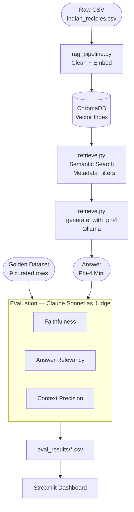
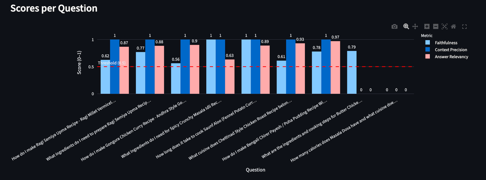
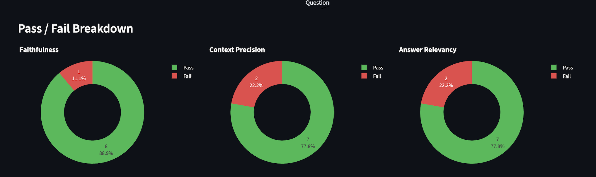
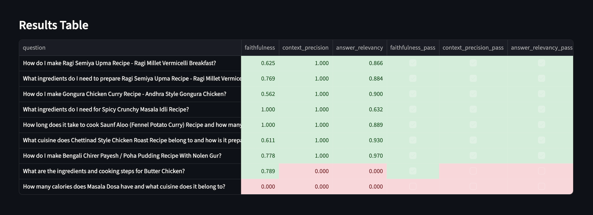

# 🍛 Indian Recipes RAG — Evaluation Pipeline

An end-to-end **Retrieval-Augmented Generation (RAG)** pipeline for Indian recipe Q&A, with a custom LLM evaluation framework built on the **RAG Triad** — Faithfulness, Answer Relevancy, and Context Precision — using **Claude Sonnet 4.6** as the judge.

---

## What This Project Does

A user asks a natural language question like *"How do I make Butter Chicken?"* or *"What are low-calorie South Indian recipes under 30 minutes?"*

The system:
1. **Retrieves** the most relevant recipe chunks from ChromaDB using semantic search + metadata filters
2. **Generates** a grounded answer using Phi-4 Mini (local, via Ollama)
3. **Evaluates** the answer quality across three RAG Triad metrics using Claude Sonnet as judge
4. **Visualises** results in an interactive Streamlit dashboard

---

## Architecture



---

## Dashboard







---

## Evaluation Results

Scores across 9 golden test cases (7 real + 2 deliberate fail rows):

| Metric | Mean Score | Pass Threshold |
|--------|-----------|----------------|
| **Faithfulness** | 0.682 | 0.5 |
| **Context Precision** | 0.778 | 0.5 |
| **Answer Relevancy** | 0.674 | 0.5 |

The 2 deliberately mismatched rows (wrong context paired with unrelated questions) correctly scored **Context Precision = 0.000**, confirming the evaluator catches retrieval failures.

---

## RAG Triad — What Each Metric Measures

```
FAITHFULNESS          ANSWER RELEVANCY      CONTEXT PRECISION
"Did the LLM          "Did the LLM          "Did the retriever
 stay grounded?"       answer the             fetch the right
                       right question?"       chunks?"

Detects:              Detects:              Detects:
Hallucination         Off-topic answers     Bad retrieval

Score = supported /   Score = similarity    Score = relevant /
        total claims   of reverse questions  total chunks
```

---

## Tech Stack

| Layer | Tool | Why |
|-------|------|-----|
| Embeddings | `all-MiniLM-L6-v2` (SentenceTransformers) | Fast 384-dim semantic vectors |
| Vector DB | ChromaDB | Persistent cosine similarity search + metadata filters |
| Generator | Phi-4 Mini via Ollama | Free local LLM — tests the RAG, not the model |
| Evaluation | RAGAS framework | Standardised RAG Triad metric implementations |
| Judge | Claude Sonnet 4.6 (Anthropic) via `LangchainLLMWrapper` | Plugged into RAGAS as the LLM judge |
| Testing | Pytest | Session-scoped fixtures — score 9 rows once, assert 3 metrics |
| Dashboard | Streamlit + Plotly | Interactive result exploration |

---

## Project Structure

```
recipie-ragas-evaluation/
├── rag_pipeline.py                    # Clean CSV → embed → build ChromaDB
├── retrieve.py                        # Filtered retrieval + Phi-4 generation
├── dashboard.py                       # Streamlit results dashboard
│
├── eval_tests/ragas_eval/
│   ├── test_faithfulness.py           # Faithfulness metric only
│   ├── test_answer_relevancy.py       # Answer Relevancy metric only
│   ├── test_context_precision.py      # Context Precision metric only
│   └── test_ragas_evaluation.py       # All 3 metrics — one pytest session
│
├── golden_data_set/
│   ├── indian_recipies_dataset.csv    # 9 curated test cases
│   └── indian_recipies_dataset.xlsx   # Same data in Excel
│
├── eval_results/                      # CSVs written by tests (gitignored)
├── data/                              # Raw + cleaned CSVs (gitignored)
├── chroma_db/                         # Vector index (gitignored)
├── Example.ipynb                      # Standalone RAG Triad demo
├── requirements.txt
└── PROJECT_OVERVIEW.md                # Full technical deep-dive
```

---

## How to Run

### 1. Install dependencies

```bash
pip install -r requirements.txt
```

### 2. Install Ollama + Phi-4 Mini (answer generator)

```bash
brew install ollama
ollama pull phi4-mini:3.8b
ollama serve          # keep running in a separate terminal
```

### 3. Add your Anthropic API key

```bash
echo "ANTHROPIC_API_KEY=sk-ant-your-key-here" > .env
```

### 4. Build the vector store (first time only)

```bash
python3 rag_pipeline.py
```

### 5. Run evaluation tests

```bash
# All 3 metrics in one run (recommended)
pytest eval_tests/ragas_eval/test_ragas_evaluation.py -v -s

# Or run individually
pytest eval_tests/ragas_eval/test_faithfulness.py -v -s
pytest eval_tests/ragas_eval/test_answer_relevancy.py -v -s
pytest eval_tests/ragas_eval/test_context_precision.py -v -s
```

### 6. View results in dashboard

```bash
streamlit run dashboard.py
```

### 7. Try a live query

```bash
python3 retrieve.py "low calorie South Indian breakfast under 30 minutes"
python3 retrieve.py --max-calories 300 --max-time 20 "vegetarian lunch"
```

---

## Cost Estimate

Running the full 9-row golden dataset costs approximately **$0.09** in Claude API fees (~7 calls per row at Sonnet 4.6 pricing).

---

## Key Design Decisions

**How RAGAS + Claude work together**
RAGAS provides the metric framework (Faithfulness, Answer Relevancy, Context Precision). Claude Sonnet 4.6 is plugged in as the LLM judge via `LangchainLLMWrapper(ChatAnthropic(...))` — replacing the default LLM with a more capable and instruction-following model for reliable scoring.

**Why Phi-4 as generator?**
The goal is to evaluate the RAG pipeline quality (retrieval + context), not the LLM's raw knowledge. A free local model keeps cost at zero and makes the evaluation about the data, not the model.

**Why 2 deliberate fail rows?**
Rows 8–9 pair questions with completely wrong contexts. If the evaluator passes those rows, the scoring logic is broken. They act as a sanity check on the evaluator itself.

---

## Data Sources

The recipe dataset was built by merging two public Kaggle datasets:

| Dataset | Author | Link |
|---------|--------|------|
| Indian Food Nutrition | batthulavinay | [kaggle.com/datasets/batthulavinay/indian-food-nutrition](https://www.kaggle.com/datasets/batthulavinay/indian-food-nutrition) |
| Cleaned Indian Recipes Dataset *(subset)* | sooryaprakash12 | [kaggle.com/datasets/sooryaprakash12/cleaned-indian-recipes-dataset](https://www.kaggle.com/datasets/sooryaprakash12/cleaned-indian-recipes-dataset) |

> The `cleaned-indian-recipes-dataset` is a subset of the `indian-food-nutrition` dataset. Both were merged and further cleaned (column normalisation, duplicate removal, null handling) via `rag_pipeline.py → clean_and_save()`.
>
> Raw data is not included in this repository (see `.gitignore`). Download the source datasets from Kaggle and place them in `data/` before running `rag_pipeline.py`.

---

## Skills Demonstrated

- RAG pipeline design and implementation
- LLM evaluation (RAG Triad framework)
- Vector database usage (ChromaDB + cosine similarity + metadata filtering)
- Prompt engineering for structured judge outputs
- ML testing with Pytest (session fixtures, incremental CSV saving)
- Interactive data visualisation (Streamlit + Plotly)
- Golden dataset curation with deliberate failure cases
